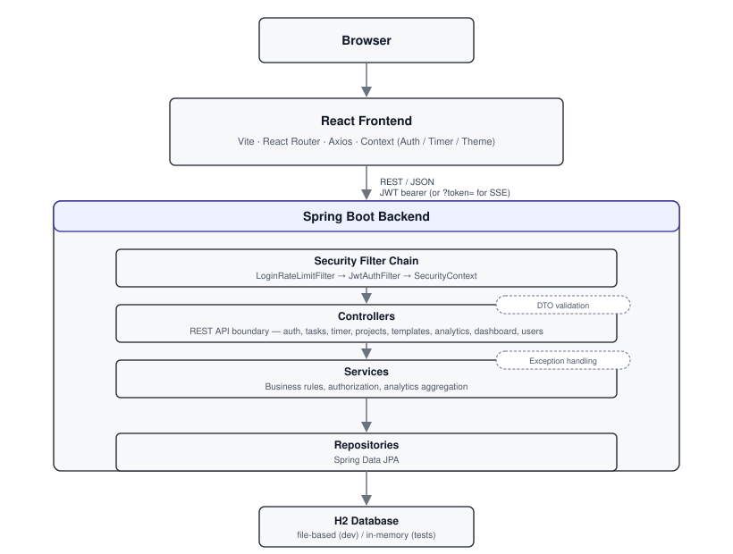

# TimeTracker

A full-stack time-tracking application: users authenticate with JWT, run a live timer or log time manually, and organize work into nested, shareable projects. Time entries roll up into daily/weekly/monthly overviews, an activity heatmap, and per-contributor breakdowns on shared projects, with project budgets, reusable task templates, and CSV/JSON export layered on top. The backend enforces authorization in the service layer (not just the UI), and the whole stack is covered by unit, integration, and end-to-end tests with coverage and mutation-testing gates enforced in CI.

## Application Preview

No screenshots are checked into the repository yet. The most useful ones to capture from the running app (`docker compose up --build`, then `http://localhost:3000`) would be:

- **Dashboard** — live timer, today/week totals, top projects with budget status
- **Projects** — nested project tree with a budget progress bar
- **Analytics** — activity heatmap and shared-project contributor breakdown
- **Project sharing** — member list with OWNER/MEMBER roles

## Engineering Highlights

- **Authorization enforced in the service layer, not the UI.** Every project/task/template lookup goes through `findByIdAndUser` (owner-only) or `findByIdAndMember` (any collaborator) at the repository level — a non-member gets a 404 rather than a 403, so the API doesn't even confirm a resource exists to users who can't see it.
- **Multi-user project collaboration with real role checks.** Projects can be shared by inviting a registered user by email; each membership carries an `OWNER` or `MEMBER` role, and operations like edit/delete/invite/remove-member are restricted to the owner in `ProjectService`, independent of anything the frontend hides.
- **Login throttling ahead of the security filter chain.** A dedicated `LoginRateLimitFilter` (ordered before Spring Security) rate-limits `POST /api/auth/login` per IP via `RateLimitService`, so brute-force attempts are rejected before they reach authentication logic.
- **Cross-tab timer sync over Server-Sent Events.** `GET /api/timer/events` streams `timer-started`/`timer-stopped` events so a running timer stays in sync across browser tabs without polling; the JWT filter accepts the token as a query parameter specifically because `EventSource` can't set an `Authorization` header.
- **Continuity across sessions for recurring work.** Starting a task from a template doesn't reset the clock — `TaskTemplateService` sums the durations of every prior completed task with the same description and seeds the new task's `totalPreviousSeconds`, so the frontend timer shows accumulated time correctly.
- **Timezone-aware aggregation, not just display formatting.** Daily/weekly boundaries for the heatmap, weekly pattern, and dashboard summary are computed against the user's stored IANA timezone (`ZoneId.of(user.getTimezone())`) on the backend, not just formatted for display on the frontend.
- **Mutation testing on top of coverage.** PITest runs against every class in `com.timetracker.service.*` with a required test-strength threshold of 80%, catching tests that pass despite not actually exercising the business logic they claim to cover.
- **Quality gates fail the build, not just a linter warning.** `./mvnw verify` fails if JaCoCo line coverage drops below 90% or Checkstyle reports a violation; `npm run test:coverage` enforces separate thresholds per metric (lines/statements 90%, functions 85%, branches 80%).
- **CI runs the real stack for end-to-end tests.** The `system-tests` job only starts after backend and frontend jobs pass, then brings up the full Docker Compose stack, polls `/api/health`, and runs 31 Playwright specs against it in a containerized browser.

## Features

### Time Tracking
- Live timer (single active timer per user, enforced server-side) with cross-tab sync via SSE
- Manual time entries with explicit start/end times, independent of the timer
- Edit and (soft) delete existing entries

### Project Management
- Nested projects (self-referencing parent/subproject hierarchy)
- Project budgets (hours), with computed status: on track / warning (≥80%) / over budget (≥100%)
- Task templates that recall a task's accumulated time across sessions

### Collaboration
- Project sharing by inviting a registered user by email
- Owner vs. member roles, enforced in the service layer
- Per-contributor time breakdown on shared projects

### Reporting
- Daily / weekly / monthly overviews
- Activity heatmap and weekly time-of-week pattern
- CSV and JSON export per project, with date-range or year/month filtering

### User Preferences
- Preferred IANA timezone, applied to both display and backend aggregation
- Profile and password management

## Architecture



| Layer | Responsibility |
|---|---|
| `controller/` | HTTP/API boundary — one controller per domain (auth, tasks, timer, projects, templates, analytics, dashboard, user profile) |
| `service/` | Business rules, authorization checks, analytics aggregation — the PITest mutation-testing target |
| `repository/` | Spring Data JPA persistence; ownership vs. membership queries (`findByIdAndUser` / `findByIdAndMember`) |
| `dto/` | Request/response records, Bean Validation annotations |
| `entity/` | JPA domain model |
| `security/` | `JwtAuthFilter`, `LoginRateLimitFilter`, `JwtTokenProvider`, `UserDetailsServiceImpl` |
| `exception/` | One exception per domain error, mapped to HTTP status by a `@RestControllerAdvice` |

On the frontend, most state lives in three React contexts rather than a global store: `AuthContext` (JWT + user profile in `localStorage`), `TimerContext` (rehydrates the active task from the backend on mount, ticks locally, listens for SSE updates), and `ThemeContext`/`ToastContext` for UI concerns. Pages (`src/pages/`) own their own local state and call a thin Axios wrapper per backend resource (`src/api/`); there's no separate component library — the heatmap and budget progress bar are plain CSS/DOM built inline in the pages that use them.

## Core Domain

A `User` owns projects and tasks. A `Project` can have a parent project (forming a nested hierarchy) and can be shared with other users through `ProjectMember` records that carry a role — `OWNER` (can edit, delete, invite, and remove members) or `MEMBER` (can attach tasks and view). A `Task` always belongs to the user who did the work, but can be associated with multiple projects (including shared ones) through a `task_projects` join table, and is soft-deleted rather than removed outright. A task is either a live timer session (`endTime` null while running) or a manually entered block of time with explicit start/end timestamps — manual entries bypass the single-active-timer rule entirely. A `TaskTemplate` lets a user restart previously tracked work under the same description; the backend recomputes the accumulated total across all prior completed tasks with that description each time. A project's `budgetHours`, compared against summed usage across its full subtree, produces a status (`ON_TRACK` / `WARNING` / `OVER_BUDGET`) computed once (`ProjectService.computeBudgetStatus`) and reused by both the project summary and dashboard endpoints.

## Authentication & Access Control

Passwords are hashed with BCrypt at registration; login delegates credential checking to Spring Security's `AuthenticationManager`. Authenticated requests carry a stateless JWT — `JwtTokenProvider` signs it with an HMAC key derived from `app.jwt.secret` and a 24-hour expiration, and `JwtAuthFilter` reads it from the `Authorization` header (or a `?token=` query parameter, needed for the SSE endpoint) on every request, populating the Spring Security context if the token is valid. A separate `LoginRateLimitFilter` throttles login attempts per IP before they reach the authentication filter chain.

Authorization is enforced in the service layer, not just the controllers: operations that require ownership look resources up with `findByIdAndUser` and 404 for anyone else; operations available to any collaborator use `findByIdAndMember`. Direct ownership violations (e.g. editing another user's task) throw `AccessDeniedException`, mapped to a 403 by the global exception handler.

`JWT_SECRET` has a hardcoded fallback in `application.properties` so the app runs out of the box in development and CI without any configuration. That default is fine for local use but must **not** be relied on in production — anyone who reads the source knows it and could forge tokens. Production deployments should set:

```bash
export JWT_SECRET="<strong-random-secret-at-least-32-chars>"
```

## Collaboration

Projects are shared by inviting an already-registered user by email; creating a project automatically makes the creator its `OWNER`. Owners can edit or delete the project, invite or remove members, and force-delete a project with associations; members can attach tasks, view the project summary, and pull an export, but cannot modify the project or its membership — the owner cannot be removed. Contributor analytics (`GET /api/analytics/shared-breakdown`) sum each member's tracked time on a shared project within a rolling window and report each person's percentage of the total, limited to projects with at least two contributors and nonzero recorded time.

## Analytics

Aggregation happens in the backend, in memory, over data fetched with date-range repository queries — not via SQL `GROUP BY`, and not recomputed on the frontend:

- **Heatmap** buckets a year of completed tasks by calendar day (zone-aware) and sums seconds per day.
- **Weekly pattern** buckets by day of week and averages over a configurable number of weeks.
- **Shared breakdown** computes per-contributor totals and percentages for shared projects.
- **Dashboard summary** computes today's/this week's totals and the user's top projects, each annotated with budget status.

Future-year queries are handled by forcing the computed `from` date after `to`, which the underlying `BETWEEN` query resolves to zero rows rather than needing a separate empty-state branch.

## Time-Zone Handling

Each user has a preferred IANA timezone (default `UTC`), stored on the `User` entity; all timestamps are persisted in UTC. The frontend uses `Intl.DateTimeFormat` for display and a DST-safe offset-correction routine (`localDateToUtcIso`) when converting a date picked in the user's local timezone back to UTC for the API. The backend also uses the same timezone preference server-side — the heatmap, weekly pattern, and dashboard summary all compute their day/week boundaries with `ZoneId.of(user.getTimezone())`, so which calendar day a task's tracked seconds land in depends on the user's timezone setting, not the server's.

## Testing Strategy

| Level | Tooling | What it covers |
|---|---|---|
| Backend unit | JUnit 5 + Mockito | Service-layer business rules and authorization, with all dependencies mocked |
| Backend integration | Spring Boot Test + MockMvc + H2 (in-memory) | Controllers through to the database, per user story |
| Frontend unit | Vitest + React Testing Library | Pages, contexts, and utilities, with `src/api/*` mocked |
| End-to-end | Playwright (Chromium) | 31 spec files — one per user story/NFR, run against the full Docker Compose stack |
| Mutation testing | PITest | Whether service-layer tests actually detect changes to the code they cover, not just execute it |

**Numbers, verified by running the suites:** 535 backend tests (`./mvnw test`), 339 frontend tests across 16 files (`npm test`), 31 Playwright spec files. Mutation testing runs only against `com.timetracker.service.*` (the intentional PITest scope) with `DEFAULTS` mutators and an enforced 80% test-strength threshold.

## Code Quality

| Gate | Threshold | Enforced by |
|---|---|---|
| Backend tests | all pass | `./mvnw verify` |
| Backend line coverage | ≥ 90% | JaCoCo, bound to `verify` |
| Backend style | 0 violations | Checkstyle, bound to `verify` |
| Service mutation coverage | ≥ 80% test strength | PITest against `com.timetracker.service.*` |
| Frontend tests | all pass | `npm run test:coverage` |
| Frontend coverage | lines/statements ≥ 90%, functions ≥ 85%, branches ≥ 80% | Vitest (v8 provider) |
| Frontend lint | 0 warnings/errors | oxlint |

`./mvnw verify` and `npm run test:coverage` fail the build outright when any of these thresholds aren't met — coverage and lint are release gates, not a separate report to check after the fact.

## Continuous Integration

A single GitHub Actions workflow (`.github/workflows/ci.yml`), triggered on pushes and pull requests to `main`, runs on self-hosted runners:

```text
push / pull_request
        |
        +--> backend    (container: eclipse-temurin:21-jdk)
        |       mvnw verify
        |       mvnw pitest:mutationCoverage
        |
        +--> frontend   (container: node:24-alpine)
        |       npm ci
        |       npm run lint
        |       npm run test:coverage
        |       npm run build
        |
        +--> system-tests   (needs: backend, frontend)
                docker compose up -d --build
                poll /api/health and the frontend
                playwright test   (container: mcr.microsoft.com/playwright)
                upload playwright-report/ (always)
                docker compose down -v (always)
```

This is **continuous integration**, not continuous deployment — there is no deploy, registry push, or hosting step in the pipeline.

## Tech Stack

| Area | Technologies |
|---|---|
| Backend | Java 21, Spring Boot 3.4.1, Spring Security 6, Spring Data JPA |
| Persistence | H2 (file-based in dev/Docker, in-memory for tests); PostgreSQL wired for the optional prod Compose profile |
| Frontend | React 19, Vite 8, React Router 7, Axios |
| Authentication | JWT (jjwt 0.12.6), BCrypt |
| Backend testing | JUnit 5, Mockito, Spring MockMvc |
| Frontend testing | Vitest, React Testing Library |
| E2E | Playwright 1.61.1 |
| Quality | JaCoCo, PITest, Checkstyle, oxlint |
| Infrastructure | Docker, Docker Compose |
| CI | GitHub Actions |

## Project Structure

```text
backend/src/main/java/com/timetracker/
├── controller/      REST/API boundary
├── service/         Business logic and authorization (PITest target)
├── repository/      Spring Data JPA repositories
├── entity/          JPA domain model
├── dto/             Request/response records
├── security/        JWT, rate limiting, user details
├── exception/       Domain exceptions + global handler
└── config/          Security, CORS, membership seeding

frontend/src/
├── pages/           One file + co-located test per screen
├── context/         Auth, Timer, Theme, Toast (React Context, no Redux)
├── components/      Layout, ProtectedRoute, ErrorBoundary
├── api/             Thin Axios wrappers, one per backend resource
└── utils/           Timezone-aware date helpers

frontend/e2e/        Playwright specs, one per user story/NFR
```

## Getting Started

### Docker — recommended

```bash
git clone https://github.com/AliAkbarBaloch/Time-Tracker-App.git
cd Time-Tracker-App
docker compose up --build
```

| Service | URL |
|---|---|
| Frontend | http://localhost:3000 |
| Backend API | http://localhost:8080 |
| Health check | http://localhost:8080/api/health |

Register an account from the UI once both services are healthy. No configuration is required for local use — see [Authentication & Access Control](#authentication--access-control) for the `JWT_SECRET` production note.

To wipe all local data:

```bash
docker compose down -v
docker compose up --build
```

### Local Development

Requires Java 21 and Node 24+ (matches `frontend/package.json` `engines` and the Docker/CI images).

```bash
# Terminal 1 — backend
cd backend
./mvnw spring-boot:run        # http://localhost:8080

# Terminal 2 — frontend
cd frontend
npm install
npm run dev                    # http://localhost:3000, proxies /api to :8080
```

### Environment Variables

| Variable | Default | Purpose |
|---|---|---|
| `JWT_SECRET` | built-in dev fallback | Signing key for JWTs — set explicitly in production |
| `APP_RATE_LIMIT_LOGIN_PER_MINUTE` | 10 (raised to 1000 in `docker-compose.yml` for local use) | Login attempts allowed per IP per minute |

## Running the Tests

```bash
# Backend — unit + integration tests
cd backend && ./mvnw test

# Backend — tests + coverage + Checkstyle (fails build on threshold miss)
./mvnw verify

# Backend — mutation testing (slow, ~2 min)
./mvnw org.pitest:pitest-maven:mutationCoverage

# Frontend — unit tests
cd frontend && npm test

# Frontend — tests + coverage thresholds
npm run test:coverage

# Frontend — lint
npm run lint

# End-to-end (requires the full stack running, e.g. via docker compose up)
npx playwright install chromium   # first run only
npx playwright test
```

## API Overview

| Resource | Base path | Examples |
|---|---|---|
| Auth | `/api/auth` | register, login, refresh, logout, password change |
| Tasks | `/api/tasks` | create, list (paginated), start, stop, active, update, delete |
| Timer | `/api/timer` | `GET /events` — SSE stream for cross-tab sync |
| Projects | `/api/projects` | CRUD, summary, members, export |
| Task templates | `/api/task-templates` | CRUD, start-from-template |
| Analytics | `/api/analytics` | heatmap, weekly-pattern, shared-breakdown |
| Dashboard | `/api/dashboard` | summary |
| User profile | `/api/users` | profile, preferences |
| Health | `/api/health` | liveness check |

## Project Documentation

[Project Report](report/report.pdf) — architecture and design decisions, requirements coverage, and notes on the AI-assisted development workflow used while building this project.

## Project Context

Built individually for the "AI-Driven Software Development" course at the University of Passau, using Claude Code as a development assistant throughout — the report documents where that workflow helped and where it didn't.
